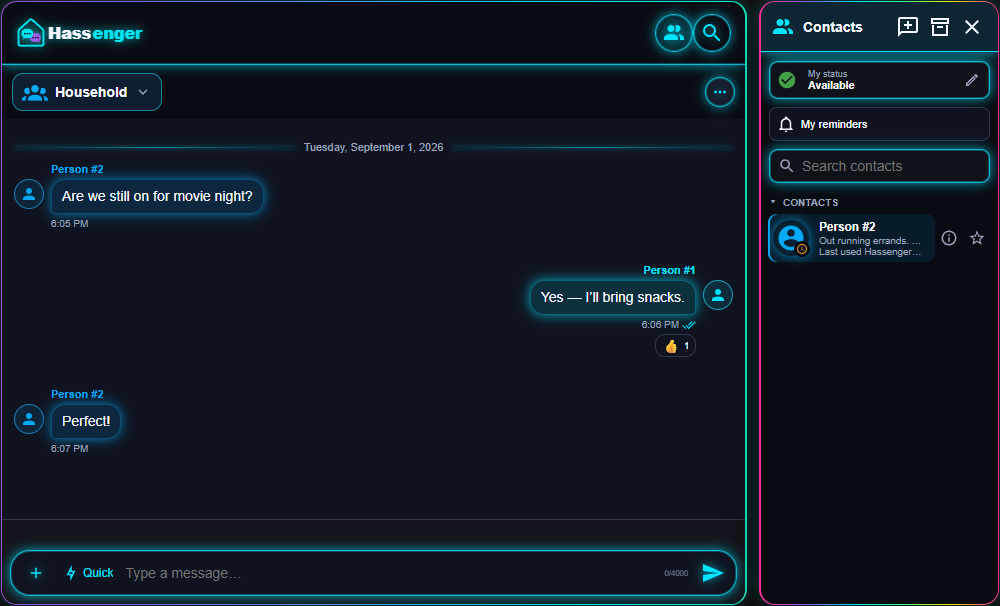
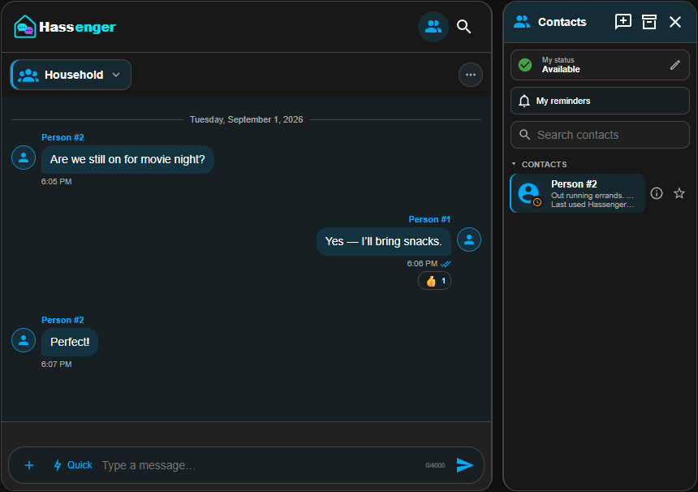
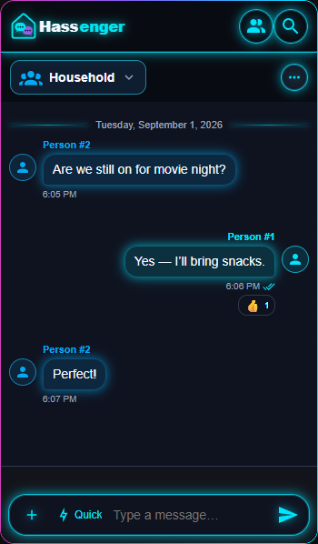
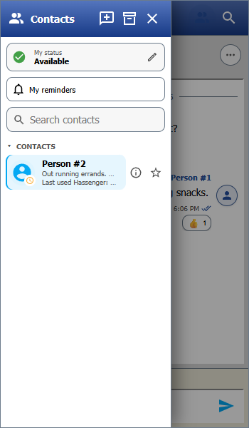
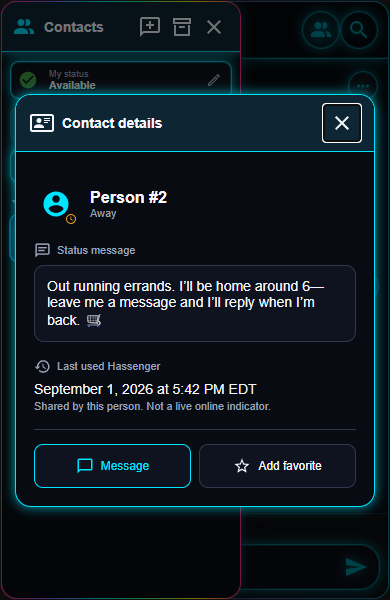
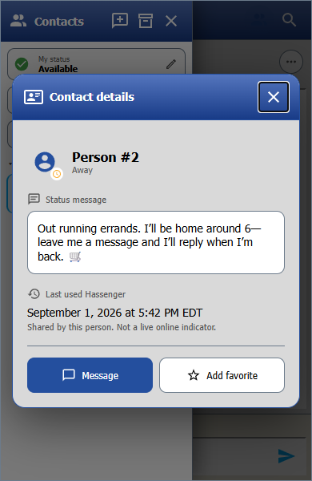

<p align="center">
  <picture>
    <source media="(prefers-color-scheme: dark)" srcset="branding/hassenger-full-logo-transparent.png">
    
  </picture>
</p>

# Hassenger

Messaging for your Home Assistant household.

[☕ Support Hassenger on Buy Me a Coffee](https://buymeacoffee.com/fallenhero)

Hassenger brings private conversations, a customizable messenger card, and optional Assist and speaker destinations to Home Assistant.



## What you can do

- Chat one-to-one or in groups with selected Home Assistant users.
- Open conversations from Contacts, share a status message, and optionally share when you last used Hassenger.
- See typing indicators and read receipts; reply, react, search, and save messages.
- Send supported images, GIFs, PDFs, and audio attachments.
- Use collapsible Quick messages, private reminders, and scheduled text.
- Add Home Assistant Assist and TTS speaker destinations.
- Choose from appearance presets, including RGB Neon and Retro Messenger, or customize colors, branding, and layout.

Contacts can open as a drawer or sit beside the chat on desktop. New cards keep a 400 px conversation area by default. Quick messages stay collapsed, and the microphone is optional.

## Screenshots

Rendered card examples using fictional people and messages. Click an image to view it at full size.

### Modern Chat — desktop



### Mobile — RGB Neon and Retro Messenger

[](docs/screenshots/mobile-rgb.png)

[](docs/screenshots/mobile-retro-contacts.png)

### Contact details — matching each preset

Full status messages, optional shared last-used information, and Message/Favorite actions.

[](docs/screenshots/contact-profile-rgb.png)

[](docs/screenshots/contact-profile-retro.png)

Screenshot icons use Material Design Icons ([Apache 2.0 license](docs/screenshots/ICON-LICENSE.txt)); the previews render Hassenger with sample Home Assistant data.

## Install

Requires **Home Assistant Core 2026.9.1 or newer**. The first release was tested by the maintainer on Core **2026.9.1**; older versions are not verified.

### HACS

1. Add [Fallen-Hero/hassenger](https://github.com/Fallen-Hero/hassenger) as a HACS custom repository with category **Integration**.
2. Download Hassenger and restart Home Assistant.
3. Go to **Settings → Devices & services → Add integration** and select **Hassenger**.
4. Add this dashboard resource as a **JavaScript module**:

   `/hassenger/hassenger-card.js?v=1.0.0`

5. Add a Manual card:

```yaml
type: custom:hassenger-card
data_source: hassenger
show_contacts: true
```

Use the card's visual editor to customize it. The integration includes the card; a separate frontend installation is not required.

### Manual installation

Copy `custom_components/hassenger` into your Home Assistant `config/custom_components` directory, restart Home Assistant, then follow steps 3–5 above.

See [First-time setup](FIRST_TIME_SETUP.md) for the guided walkthrough.

## Start chatting

Open **Contacts** and select a person to open a direct conversation. Administrators can use the new-conversation button in the Contacts heading to create groups.

Select the information button beside a person to open **Contact details** without starting a chat. It shows their full status message and optional shared last-used time, with **Message** and **Add favorite** actions. The popup inherits the active preset and supports touch, keyboard navigation, Escape, and an explicit close button. Last-used information remains hidden when the person has not enabled sharing.

Conversation actions live in **…**. Archiving hides a conversation only for you; administrators can clear or permanently delete it. Adding a participant gives them access to that conversation's existing history.

The header search searches the active conversation's retained history. Scrolling upward pauses automatic following; **Latest message** returns you to the bottom.

## Status and privacy controls

Open **Contacts → My status** to set Available, Busy, Offline, or automatic home/away behavior using your linked Home Assistant Person entity. Status messages are editable.

Last-used sharing is off by default. It describes activity in Hassenger—not reliable live online/offline presence. Typing activity is temporary and never includes draft text. You can disable sharing across your devices in My status.

Quiet hours and conversation mute affect supported notifications. In-app reminders are not phone push notifications.

## Optional phone notifications and speaker announcements

The [Mobile replies, TTS and optional sounds blueprint](blueprints/automation/hassenger/mobile_actionable_reply.yaml) connects messages to Home Assistant Companion App notifications and optional TTS announcements. It supports actionable replies, per-recipient mute, and independently controlled sounds.

Copy it into `config/blueprints/automation/hassenger/mobile_actionable_reply.yaml`, reload automations, and create an automation from the blueprint. Follow [First-time setup](FIRST_TIME_SETUP.md) to select people, devices, and optional speakers.

The [input_text helper blueprint](blueprints/automation/hassenger/legacy_input_text_message.yaml) is an alternative for helper-based setups. It is not needed for normal persistent Hassenger conversations.

## Customization

The visual editor groups settings for conversations, Contacts, branding, shortcuts, reactions, appearance, and behavior. Contacts panels and dialogs inherit the selected preset.

Custom conversation names are local display overrides; select the matching conversation before entering an override. Custom sender names also appear in typing indicators. Use **… → Edit name & participants** to rename a stored conversation for everyone.

See the [Feature guide](FEATURE_GUIDE.md) for configuration details and limits.

## Important privacy and storage notes

- Messages are stored locally in Home Assistant. The card and messaging API restrict conversation access to its participants, but this is **not end-to-end encrypted**. Host administrators, backups, and privileged automations can access data.
- Authenticated Hassenger users can discover Home Assistant contacts and shared presence. Last-used sharing is optional.
- Messages are not automatically removed by age. Administrative pruning and deletion are permanent; keep backups.
- Hassenger-managed uploads have a 10 MiB per-file limit and share a 100 MiB quota. Unreferenced files can be cleaned up on later uploads. External image URLs contact their external host.
- Exported conversations contain private data. Keep exports and backups secure.
- Speech recognition depends on browser support, a secure connection, microphone permission, and the browser's recognition service. Permission alone cannot guarantee availability.

## Help and development

- [Setup guide](FIRST_TIME_SETUP.md) · [Feature guide](FEATURE_GUIDE.md)
- [Support](SUPPORT.md) · [Security](SECURITY.md) · [Accessibility](ACCESSIBILITY.md)
- [Contributing](CONTRIBUTING.md) · [Testing](TESTING.md) · [Changelog](CHANGELOG.md)

Maintainers: release-review results and outstanding live-device/repository checks are recorded separately in [Validation report](VALIDATION_REPORT.md) and [Release checklist](RELEASE_CHECKLIST.md).
